# Pay Mobile - P2P Money Transfer App

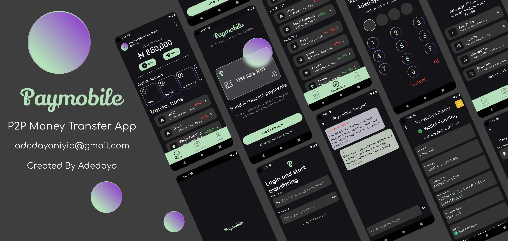

# Features (Don't forget to give it a star 🌟)

## You can perform some actions with the <a href="https://github.com/adedayoniyi/Pay-Mobile-Web-Admin"> Pay Mobile Web Admin </a>

#### 1. Pin feature used for authorizing transactions and user login

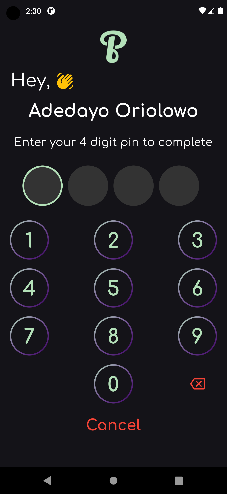

##### 2. Custom in-app notifications

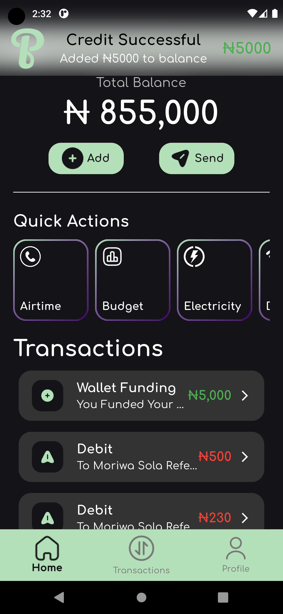

##### 3. Push notifications for transfers

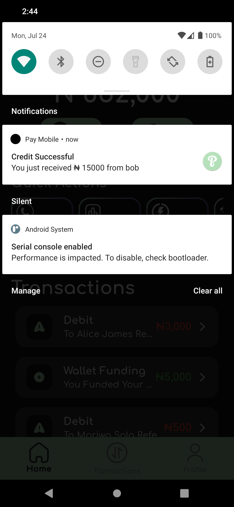

##### 4. In-app customer service support

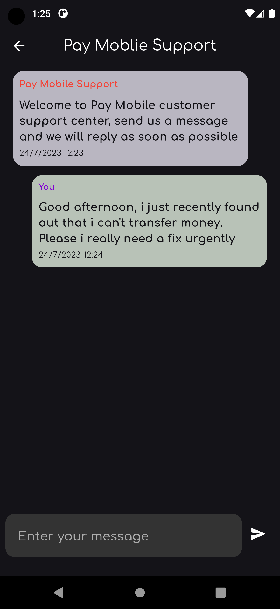

##### 5. Success Dialogs

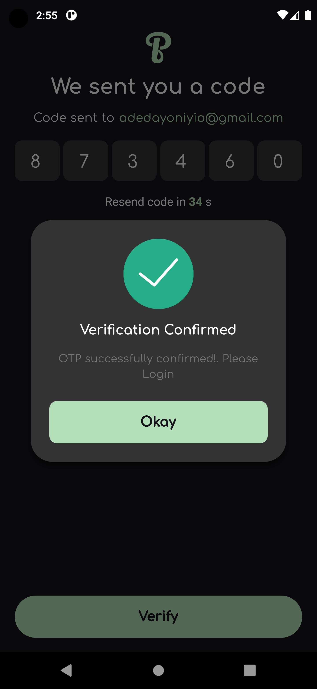

##### 6. Fully responsive(Tablet View)

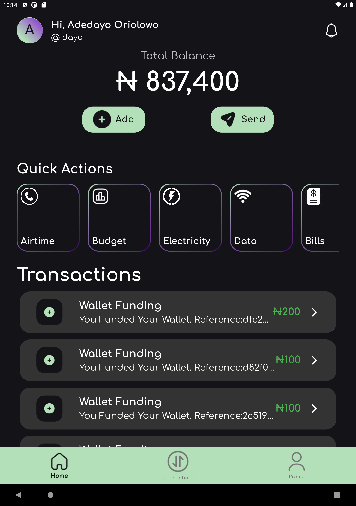

## New App Features 🌟

#### 1. Sign Up Verification

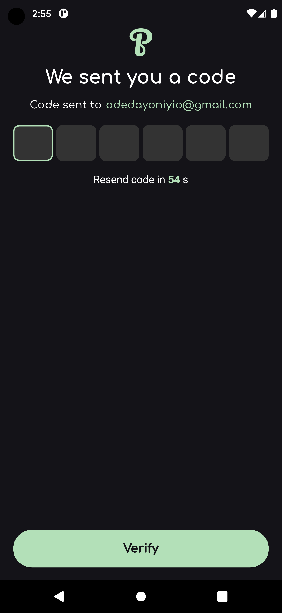

#### 2. Forgort Password

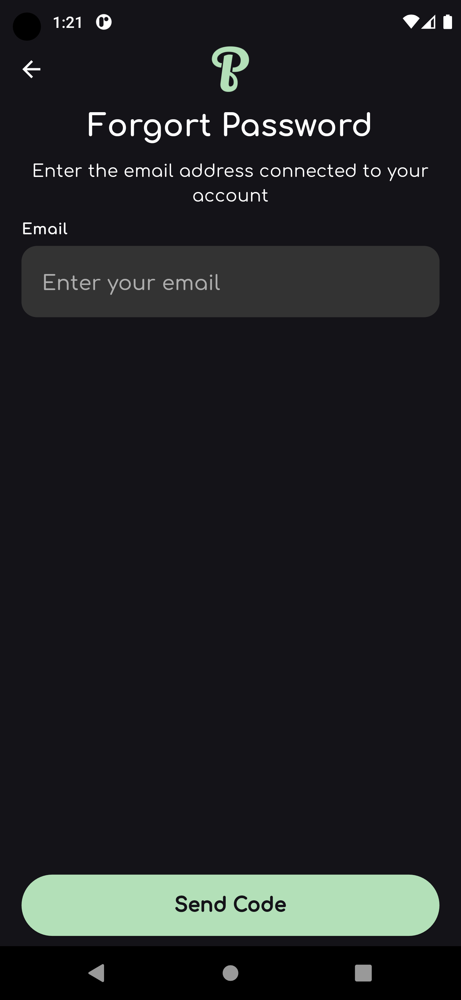

### QUICK START ⚡

#### Visit:<a href="https://github.com/adedayoniyi/Pay-Mobile-Full-Stack"> Pay Mobile Full Stack </a> to access the full stack code of the software (i.e the Back End and the Web Admin Front End)

### Note: The server running this app has already been deployed to render.com, which means you can immediately clone this repo, run it and start using it (i.e The backend is already connected).

#### Since every username on the app is unique, transfers are performed with usernames. Just enter the `@username` of the user and you can easily transfer funds

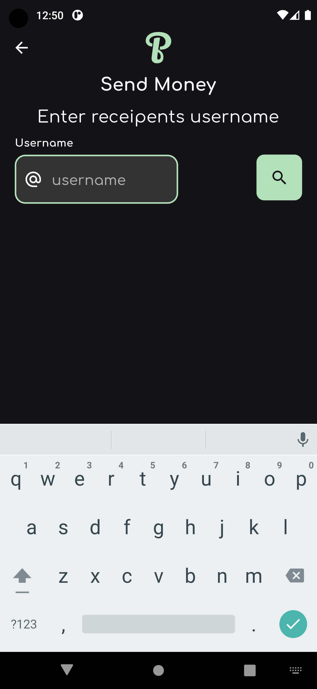

#### After the username is found then transfers can be made

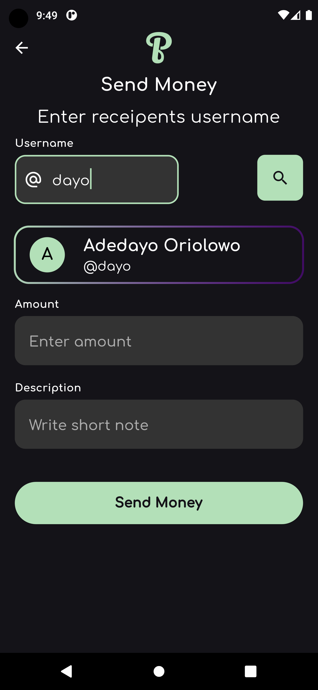

#### Then tap the transaction to view its details

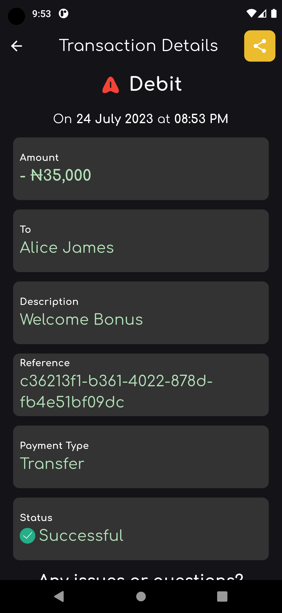

#### After cloning don't forget to run:

```bash
flutter pub get
```

## Packages Used 📦

1. <a href="https://pub.dev/packages?q=provider">provider</a>
2. <a href="https://pub.dev/packages/shared_preferences">shared_preferences</a>
3. <a href="https://pub.dev/packages/http">http</a>
4. <a href="https://pub.dev/packages/intl">intl</a>
5. <a href="https://pub.dev/packages/internet_connection_checker">internet_connrction_checker</a>

6. <a href="https://pub.dev/packages/flutter_native_splash">flutter_native_splash</a>
7. <a href="https://pub.dev/packages/firebase_core">firebase_core</a>
8. <a href="https://pub.dev/packages/firebase_messaging">firebase_messaging</a>
9. <a href="https://pub.dev/packages/cloud_firestore">cloud_firestore</a>
10. <a href="https://pub.dev/packages/socket_io_client">socket_io_client</a>
11. <a href="https://pub.dev/packages/awesome_notifications">awesome_notifications</a>

#### Here are some test login details of verified users if you don't want to create an account

```json
{
"username":"lere",
"pin":"7171",
"password":"test123",
}
{
"username":"johndoe",
"pin":"7171",
"password":"test123",
}
{
"username":"alice",
"pin":"7070",
"password":"test123",
}
{
"username":"bob",
"pin":"7474",
"password":"test123",
}
```

### If you choose to run it on your own server, visit the Pay Mobile Server Repo

## This is the official Nodejs server code that this app is running on <a href="https://github.com/adedayoniyi/Pay-Mobile-Server">Pay Mobile Server</a>

## Important

### After you are done with configuring the server, dont forget to update the uri in the global_constants.dart file

1. Locate lib\core\utils\global_constants.dart and edit line 6 using the server URL you generated or created. Changes will apply globally. Check Below:

```dart
6. const String uri = "https://transfer-dayo-niyi.onrender.com";
```

To

```dart
6. const String uri = "Your server URL";
```

## That's All 🎉🎉🎉

## Contributing

Pull requests are welcome. If you encounter any problem with the app or server, you can open an issue.

##### If you liked this project, don't forget to leave a star 🌟.

##### Note: As of now, no tests are available

## License

This project is licensed under the MIT License - see the <a href="https://github.com/adedayoniyi/Pay-Mobile-P2P-Money-Transfer-App/blob/main/LICENSE.md">LICENSE</a> file for details.
